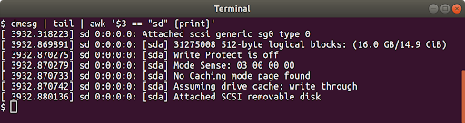

# Jetson Nano Setup For TurtleBot3 
A tutorial for setting up the NVIDIA Jetson Nano for using in the TurtleBot3 Burger robot. However, I think for the Waffle and Waffle pi, it can also be used with slight modification.
I'm using Ubuntu 18.04 LTS but if you are using Windows, Mac, this could be also very helpful.

## Introduction
**TurtleBot3** : TurtleBot3 is a small, affordable, programmable, ROS-based mobile robot for use in education, research, hobby, and product prototyping. The TurtleBot3 Burger robot is the smallest and the one that I am using here.


**NVIDIA Jetson Nano** : NVIDIA Jetson Nano Developer Kit is a small, powerful computer that lets you run multiple neural networks in parallel for applications like image classification, object detection, segmentation, and speech processing. All in an easy-to-use platform that runs in as little as 5 watts. Although the TurtleBot3 Burger comes with a Raspberry Pi 3 (mine is model B+), I don't want to use it and want to use a Jetson Nano instead. Jetson Nano can definitely give you more calculation power for your development while it's almost small as Raspberry Pi 3 and very affordable in term of electrcity consumption.


## Prepare Jetson Nano
This part is written based on the guide about [Getting Started With Jetson Nano Developer Kit](https://developer.nvidia.com/embedded/learn/get-started-jetson-nano-devkit).

This is a summary if you are using Linux. Otherwise, click on the above link and complete this part. 
You need to have:
- [x] MicroSD Card as a boot device and for main storage. The minimum recommended is a 16GB UHS-1 card.
- [x] Micro-USB Power Supply that can deliver `5V⎓2A` at the developer kit’s Micro-USB port. OR, you can also use the OpenCR on the TB3 to power the Jetson Nano from `40-pin expansion header` like this:

    

Then, you need to write Image to the microSD Card:

1. Download the `Jetson Nano Developer Kit SD Card Image` from Nvidia website, and note where it was saved on the computer.
2. Write the image to your microSD card either using a graphical program like Etcher, or via command line. I choose command line:
    - Open the Terminal application by pressing `Ctrl + Alt + t`.
    - Insert your microSD card, then use a command like this to show which disk device was assigned to it:
        ```
        dmesg | tail | awk '$3 == "sd" {print}'
        ```
    In this example, we can see the 16GB microSD card was assigned /dev/sda:

    

    - Use this command to write the zipped SD card image to the microSD card:
        ```
        /usr/bin/unzip -p ~/Downloads/jetson_nano_devkit_sd_card.zip | sudo /bin/dd of=/dev/sd<x> bs=1M status=progress
        ```
    For example:

    

    - When the dd command finishes, eject the disk device from the command line:
        ```
        sudo eject /dev/sd<x>
        ```
    - Physically remove microSD card from the computer.

    Your microSD card is ready now!

3. Unfold the paper stand and place inside the developer kit box.
4. Set the developer kit on top of the paper stand.
5. Insert the microSD card (with system image already written to it) into the slot on the underside of the Jetson Nano module:

    

6. Power on your computer display and connect it.
7. Connect the USB keyboard and mouse.
8. Connect your Micro-USB power supply (5V⎓2A) or the power cables from OpenCR on the Turtlebot 3. The Jetson Nano Developer Kit will power on and boot automatically. 
9. When you boot the first time, the Jetson Nano Developer Kit will take you through some initial setup. Complete them and log in. Congratulations!

    


